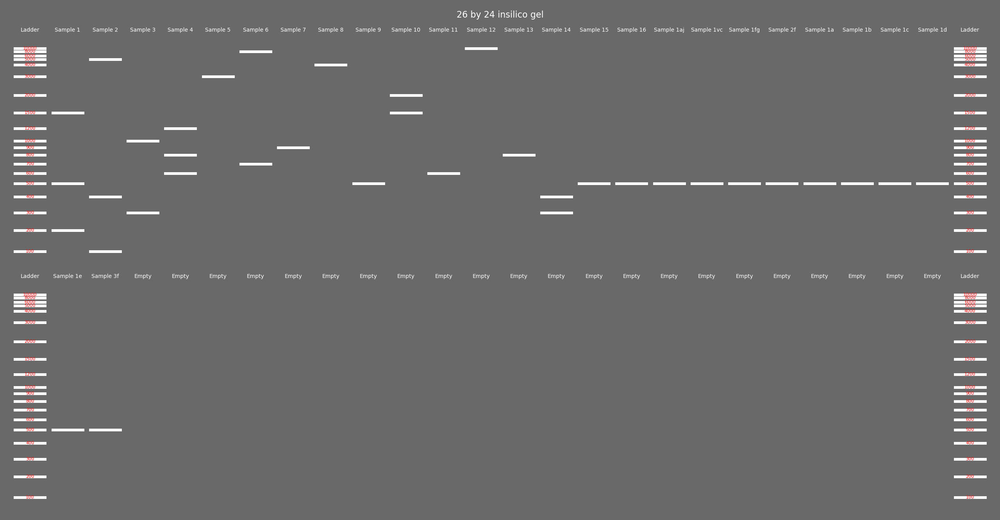

# In-silico gel electrophoresis visualization

- Take a dict of {samples : [DNA lengths list]}
- Migrate according to a reference ladder's DNA size: vertical displacement
  proportion (1kb+ only)
- assign samples to howevermany rows of length `row_len`
- Visualize hypothetical plot

## Requirements:

- numpy
- matplotlib

## shortcomings:

- band intensity is singular
- unusable standalone without some sequence parsing know-how
